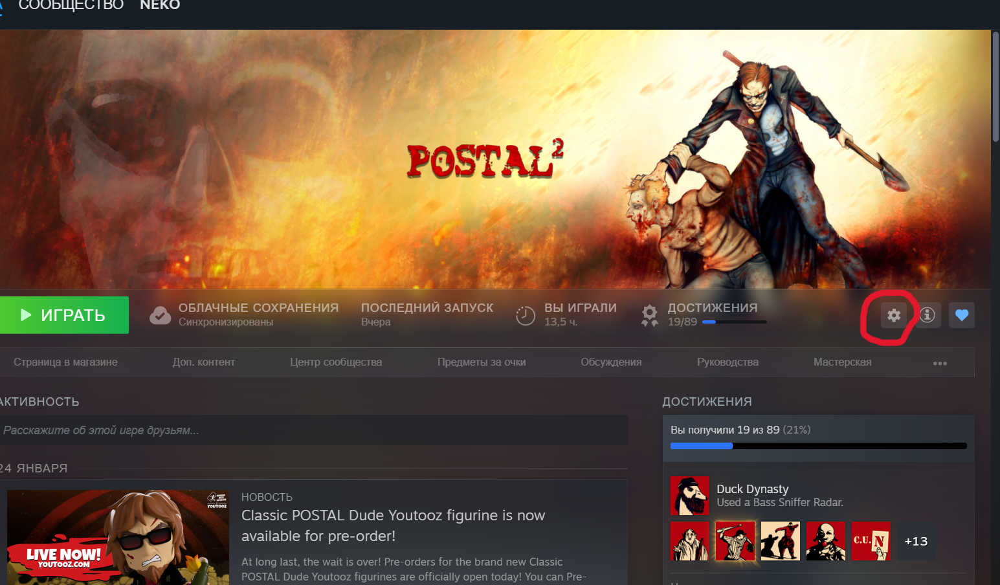
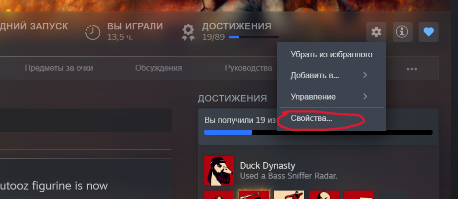
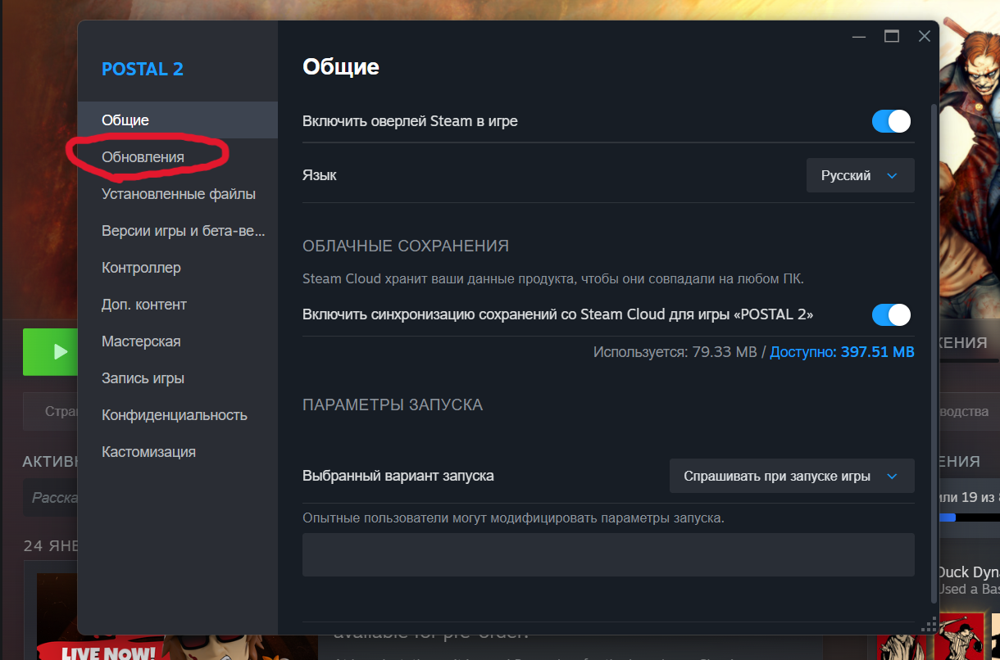

# 🎯 Loger

**Loger** — утилита для автоматической диагностики проблем с модами и играми в Steam.  

Утилита помогает:

- Найти установленный Steam на компьютере
- Определить игру по APP_ID
- Проверить логи и ошибки модов
- Автоматически показать, что работает, а если что-то не так — предложить готовые решения

---

## ⚙️ Системные требования

- Windows 10 / 11  
- Установленный Steam  
- Для сборки exe (не обязательно для использования): Python 3.12, PyInstaller  

> Для запуска exe Python не нужен — утилита полностью автономная.

---

## 🚀 Установка и запуск

1. Перейдите в релизы и скачайте последнюю версию [loger](https://github.com/nataliatyty4-hub/Loger.Steam/releases/latest)
2. Отройте так:

<table>
<tr>
<td>Диагностика.zip</td>
<td>></td>
<td>loger</td>
<td>></td>
<td>ПРИЛОЖЕНИЕ ТУТ</td>
<td>></td>
<td>loger.exe</td>
</tr>      
</table>

---


## 📝 Использование

1. Запустите `loger.exe`  
2. Введите **APP_ID** игры
3. Дождитесь результата диагностики:  

- ✅ Всё в порядке  
- ❌ Не получилось → утилита предложит решения

---

## 🔎 Как найти APP_ID игры (Пример Postal 2)

Пример пошагово с картинками:

1. Откройте Steam → библиотека → Postal 2

<td><img src="step4.png"

Примечание

```
С первой версии [Loger.Release](https://github.com/nataliatyty4-hub/Loger.Steam/releases/tag/FullRelease) id приложения больше не нужен, нужно просто ввести номер приложения: 1,2,3 и так далее.
```
---

## 🔧 Для разработчиков (сборка exe)

1. Установите PyInstaller:

```powershell
python -m pip install pyinstaller
