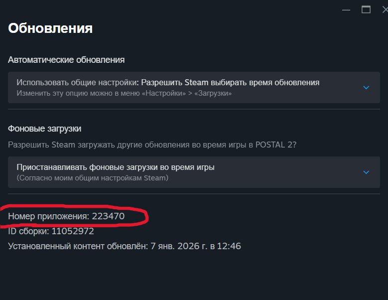

# 🎯 Steam Workshop Auto Diagnostic

**Steam Workshop Auto Diagnostic** — утилита для автоматической диагностики проблем с модами и играми в Steam.  

Утилита помогает:

- Найти установленный Steam на компьютере
- Определить игру по APP_ID
- Проверить логи и ошибки модов
- Автоматически показать, что работает, а если что-то не так — предложить готовые решения

---

## ⚙️ Системные требования

- Windows 10 / 11  
- Установленный Steam  
- Для сборки exe (не обязательно для использования): Python 3.12, PyInstaller  

> Для запуска exe Python не нужен — утилита полностью автономная.

---

## 🚀 Установка и запуск

1. Скачайте `loger.exe`  
2. Поместите его в любую папку  
3. Дважды кликните, чтобы запустить  

> exe работает без исходного `loger.py`.

---

## 📝 Использование

1. Запустите `loger.exe`  
2. Введите **APP_ID** игры (если используется консольная версия)  
3. Дождитесь результата диагностики:  

- ✅ Всё в порядке  
- ❌ Не получилось → утилита предложит решения

---

## 🔎 Как найти APP_ID игры (Пример Postal 2)

Пример пошагово с картинками:

<table>
<tr>
1. Откройте Steam → библиотека → Postal 2  
<td>
</table>


---

## 💡 Возможные проблемы и решения

| Проблема | Возможные решения |
|----------|-----------------|
| Steam не найден | Проверьте путь установки Steam |
| Игра не найдена | Убедитесь, что AppID верный и игра установлена |
| Логи недоступны | Проверьте права доступа и наличие папки `logs` |
| Ошибка модов | Перезапустите Steam, проверьте интернет или кэш загрузки |

---

## 🔧 Для разработчиков (сборка exe)

1. Установите PyInstaller:

```powershell
python -m pip install pyinstaller
